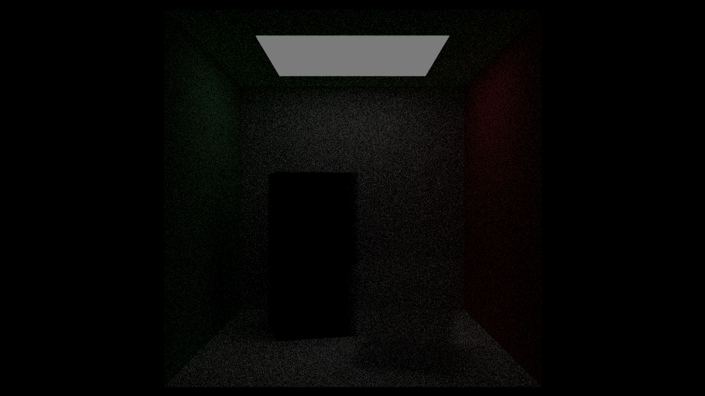

# Raytracing

Implementation of "Raytracing in one weekend" and "The next week" by Peter Shirley (http://in1weekend.blogspot.com/2016/01/Ray-tracing-in-one-weekend.html)

Partially inspired from this excellent article "Accelerated Ray Tracing in One Weekend in CUDA" by Roger Allen (https://devblogs.nvidia.com/accelerated-ray-tracing-cuda/)

## How to compile and run

Since this uses CUDA you will need nvcc. Just use `make run`.




```bash
/usr/local/cuda-11.6/nsight-compute-2022.1.1/target/linux-desktop-glibc_2_11_3-x64/ncu --export /home/jaf/cs533/final-project/raytracing/baseline --force-overwrite --target-processes all --replay-mode kernel --kernel-name-base function --launch-skip-before-match 0 --section ComputeWorkloadAnalysis --section InstructionStats --section LaunchStats --section MemoryWorkloadAnalysis --section MemoryWorkloadAnalysis_Chart --section MemoryWorkloadAnalysis_Tables --section Nvlink_Tables --section Nvlink_Topology --section Occupancy --section SchedulerStats --section SourceCounters --section SpeedOfLight --section SpeedOfLight_RooflineChart --section WarpStateStats --sampling-interval auto --sampling-max-passes 5 --sampling-buffer-size 33554432 --profile-from-start 1 --cache-control all --clock-control base --apply-rules yes --import-source no --check-exit-code yes /home/jaf/cs533/final-project/raytracing/raytracing 1280 720 64 out_baseline.png
```


/usr/local/cuda-11.6/nsight-compute-2022.1.1/target/linux-desktop-glibc_2_11_3-x64/ncu --export /home/jaf/cs533/final-project/raytracing/optimal_sample_no_init --force-overwrite --target-processes all --replay-mode kernel --kernel-name-base function --launch-skip-before-match 0 --section ComputeWorkloadAnalysis --section InstructionStats --section LaunchStats --section MemoryWorkloadAnalysis --section MemoryWorkloadAnalysis_Chart --section MemoryWorkloadAnalysis_Tables --section Nvlink_Tables --section Nvlink_Topology --section Occupancy --section SchedulerStats --section SourceCounters --section SpeedOfLight --section SpeedOfLight_RooflineChart --section WarpStateStats --sampling-interval auto --sampling-max-passes 5 --sampling-buffer-size 33554432 --profile-from-start 1 --cache-control all --clock-control base --apply-rules yes --import-source no --check-exit-code yes /home/jaf/cs533/final-project/raytracing/raytracing 1280 720 64 out_optimal_sample_no_init.png